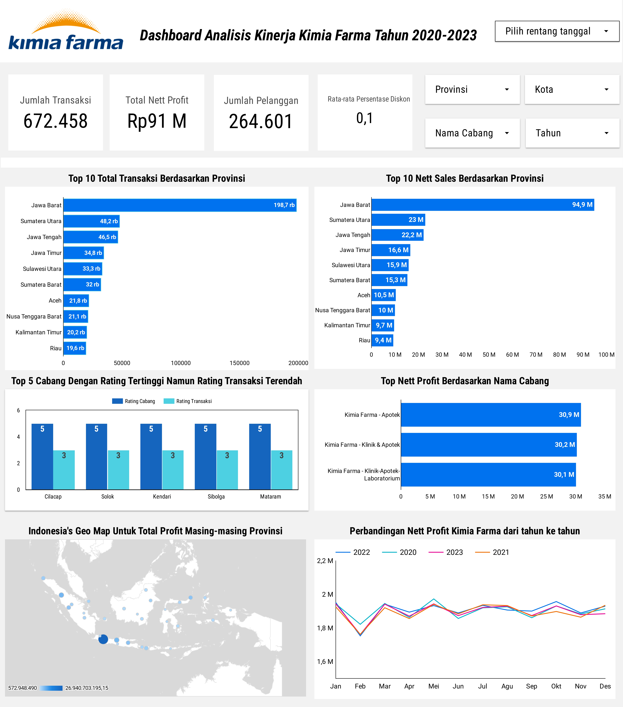

# Tentang Program 
Program *Project-Based Internship* hasil kolaborasi antara Rakamin Academy dan Kimia Farma Big Data Analytics adalah program pengembangan diri dan percepatan karier yang ditujukan bagi mereka yang tertarik mendalami posisi Big Data Analytics di Kimia Farma. Program ini menyediakan akses ke materi pembelajaran dasar, seperti *Article Reviews* dan *Company Coaching Videos*, untuk mengenalkan kompetensi dan keterampilan yang dibutuhkan oleh profesional Big Data Analytics di perusahaan tersebut. 
Selain materi, terdapat juga penilaian hasil belajar dalam bentuk tugas mingguan, yang berpuncak pada pembuatan proyek akhir yang akan menjadi portofolio peserta dalam program ini.

# Tentang Kimia Farma
Kimia Farma adalah perusahaan industri farmasi pertama di Indonesia yang didirikan oleh Pemerintah Hindia Belanda tahun 1817.
Nama perusahaan ini pada awalnya adalah NV Chemicalien Handle Rathkamp & Co. Berdasarkan kebijaksanaan nasionalisasi atas eks perusahaan Belanda di masa awal kemerdekaan, pada tahun 1958, 
Pemerintah Republik Indonesia melakukan peleburan sejumlah perusahaan farmasi menjadi PNF (Perusahaan Negara Farmasi) Bhinneka Kimia Farma. Kemudian pada tanggal 16 Agustus 1971, 
bentuk badan hukum PNF diubah menjadi Perseroan Terbatas, sehingga nama perusahaan berubah menjadi PT Kimia Farma (Persero).

# Tentang Project
Proyek ini bertujuan untuk memberikan wawasan mendalam tentang kinerja penjualan Kimia Farma melalui analisis data di BigQuery. 
Setelah pengimporan data dan pembuatan datamart, datamart tersebut akan digunakan untuk membuat sebuah dashboard performa untuk memvisualisasikan hasil analisis. 
Dashboard ini memberikan pemahaman yang mudah dipahami untuk menyusun rekomendasi peningkatan dan strategi yang lebih terarah

# Objektif
Tujuan dari proyek ini adalah untuk mengevaluasi kinerja bisnis Kimia Farma dari tahun 2020 hingga 2023. Proyek ini mencakup serangkaian tantangan, yaitu mengimpor kumpulan data ke dalam BigQuery, membuat tabel analitis, dan membangun dashboard di Google Looker Studio.

# Challenges atau Step
- **Challenge 1**: Mengimpor dataset ke dalam BigQuery. 
- **Challenge 2**: Membuat tabel analitis di BigQuery. 
- **Challenge 3**: Membuat dashboard analisis kinerja di Looker Studio. 

# Dataset dan Tools
Dataset terdiri dari 4 buah data yaitu `kf_final_transaction`,`kf_product`,`kf_inventory`,`kf_kantor_cabang`. Tools yang digunakan adalah Google Bigquery dan Looker Studio 

# Kode Bigquery
```SQL
CREATE TABLE kimia_farma.analysis_table AS
SELECT 
    ft.transaction_id,
    ft.date,
    ft.branch_id,
    kc.branch_name,
    kc.kota,
    kc.provinsi,
    kc.rating AS rating_cabang,
    ft.customer_name,
    ft.product_id,
    p.product_name,
    ft.price AS actual_price,
    ft.discount_percentage,
    
    -- Perhitungan persentase_gross_laba berdasarkan ketentuan harga
    CASE 
        WHEN ft.price <= 50000 THEN 0.10
        WHEN ft.price > 50000 AND ft.price <= 100000 THEN 0.15
        WHEN ft.price > 100000 AND ft.price <= 300000 THEN 0.20
        WHEN ft.price > 300000 AND ft.price <= 500000 THEN 0.25
        ELSE 0.30
    END AS persentase_gross_laba,
    
    -- Perhitungan nett_sales sebagai harga setelah diskon
    (ft.price * (1 - ft.discount_percentage)) AS nett_sales,
    
    -- Perhitungan nett_profit sebagai laba bersih
    ((ft.price * (1 - ft.discount_percentage)) *
        CASE 
            WHEN ft.price <= 50000 THEN 0.10
            WHEN ft.price > 50000 AND ft.price <= 100000 THEN 0.15
            WHEN ft.price > 100000 AND ft.price <= 300000 THEN 0.20
            WHEN ft.price > 300000 AND ft.price <= 500000 THEN 0.25
            ELSE 0.30
        END
    ) AS nett_profit,
    ft.rating AS rating_transaksi

FROM 
    kimia_farma.kf_final_transaction AS ft
    JOIN kimia_farma.kf_product AS p ON ft.product_id = p.product_id
    JOIN kimia_farma.kf_kantor_cabang AS kc ON ft.branch_id = kc.branch_id;
```
## Penjelasan Kueri
Kueri ini membuat tabel `kimia_farma.analysis_table` dengan menggabungkan data dari tabel transaksi, produk, dan kantor cabang di basis data Kimia Farma. 

## 1. Penggabungan Tabel
Kueri ini menggunakan `JOIN` untuk menggabungkan tiga tabel berikut:
   - `kimia_farma.kf_final_transaction` (data transaksi)
   - `kimia_farma.kf_product` (data produk)
   - `kimia_farma.kf_kantor_cabang` (data kantor cabang)
## 2. Pemilihan Kolom
Kueri ini memilih kolom penting untuk analisis, termasuk:
   - ID transaksi (`transaction_id`)
   - Tanggal transaksi (`date`)
   - ID cabang (`branch_id`)
   - Nama cabang (`branch_name`)
   - Kota (`kota`) dan provinsi (`provinsi`)
   - Nama pelanggan (`customer_name`)
   - Nama produk (`product_name`)
   - Harga awal (`price`)
   - Persentase diskon (`discount_percentage`)
## 3. Perhitungan Gross Margin
Kolom `persentase_gross_laba` dihitung berdasarkan harga produk:
   - Harga ≤ Rp50.000: gross margin 10%
   - Rp50.000 < Harga ≤ Rp100.000: gross margin 15%
   - Rp100.000 < Harga ≤ Rp300.000: gross margin 20%
   - Rp300.000 < Harga ≤ Rp500.000: gross margin 25%
   - Harga > Rp500.000: gross margin 30%
## 4. Perhitungan Nett Sales
Kolom `nett_sales` dihitung sebagai harga setelah diskon, dengan rumus nett_sales = `price * (1 - discount_percentage)`

## 5. Perhitungan Nett Profit
Kolom `nett_profit` dihitung sebagai laba bersih berdasarkan `nett_sales` dan `persentase_gross_laba`, dengan rumus `nett_profit = nett_sales * persentase_gross_laba`

## 6. Rating Transaksi
Kueri menyertakan kolom `rating_transaksi`, yang merupakan rating transaksi dari tabel transaksi (`ft.rating`).

## 7. Tujuan
Tabel `analysis_table` yang dihasilkan membantu dalam menganalisis kinerja bisnis Kimia Farma dengan menampilkan data mengenai kinerja penjualan.

# Dashboard
Dashboard Link: [Dashboard Performance Analytics Kimia Farma Business Year 2020-2023](https://lookerstudio.google.com/reporting/5db80391-f178-4bba-bc94-3c84be1e34e7)



# Insight 
1. Jumlah Transaksi yang terjadi selama tahun 2020-2023 adalah sebanyak 672.458
2. Total Nett Profit yang diperoleh selama tahun 2020-2023 adalah Rp 91 M
3. Jumlah Pelanggan selama tahun 2020-2023 adalah 264.601
4. Rata-rata Persentase Diskon adalah 0,1
5. Jawa barat berada di posisi pertama dengan jumlah nett sales sebanyak Rp94,9 M. sedangkan Sumatera Utara dan Jawa Tengah berada di posisi kedua dan ketiga dengan jumlah Rp23 M dan Rp22,2 M
6. Jawa barat berada di posisi pertama dengan jumlah transaksi sebanyak 198,7 rb transaksi, sedangkan Sumatera Utara dan Jawa Tengah berada di posisi kedua dan ketiga dengan jumlah 48,2 rb dan 46,5 rb
7. Kelima cabang (Cilacap, Solok, Kendari, Sibolga, dan Mataram) memiliki rating cabang yang tinggi (5), tetapi rating transaksi yang relatif rendah (3). Hal ini menunjukkan bahwa meskipun cabang-cabang ini dinilai baik secara kualitas atau kepuasan pelanggan, jumlah atau kualitas transaksi yang terjadi di sana mungkin belum optimal, sehingga terdapat ketidaksesuaian antara rating cabang dan performa transaksinya
8. Kimia Farma - Apotek menempati posisi pertama dengan jumlah nett profit terbanyak sebesar Rp30,9 M, Kimia Farma - Klinik dan Apotek menempati posisi kedua dengan jumlah nett profit sebesar Rp30,2 M, dan Kimia Farma - Klinik-Apotek-Laboratorium menempati posisi ketiga dengan jumlah nett profit sebesar Rp30,9 M
9. Grafik menunjukkan bahwa nett profit Kimia Farma dari 2020 hingga 2023 cenderung stabil di antara 1,7 sampai 2 Miliar Rupiah setiap bulannya. Terjadi penurunan yang signifikan setiap tahunnya antara bulan januari ke Februari.
10. Berdasarkan Hasil dari Grafik Geo Map diperoleh bahwa Provinsi Jawa barat menempati posisi pertama sebanyak Rp26,9 M disusul oleh Sumatera Utara, Jawa Tengah, dll.

# Rekomendasi Bisnis
| Aspek                                                   | Observasi                                                                                                                                       | Strategi                                                                                                                                                                                                                                  |
|---------------------------------------------------------|-------------------------------------------------------------------------------------------------------------------------------------------------|-------------------------------------------------------------------------------------------------------------------------------------------------------------------------------------------------------------------------------------------|
| **Cabang dengan Rating Cabang Tinggi tetapi Rating Transaksi Rendah** | Cabang seperti Cilacap, Solok, Kendari, Sibolga, dan Mataram memiliki rating cabang tinggi (5) tetapi rating transaksi rendah (3).              | Melakukan promosi produk lokal dan optimalkan inventaris untuk menarik lebih banyak transaksi di cabang berperingkat tinggi namun transaksi rendah serta melakukan peningkatan kualitas pelayanan karyawan.                                |
| **Provinsi dengan Potensi Pertumbuhan Transaksi dan Penjualan (Nett Sales)** | Jawa Barat memiliki total transaksi dan penjualan tertinggi, sementara Sumatera Utara, Jawa Tengah, dan lainnya jauh tertinggal.               | Menambah cabang baru di Sumatera Utara, Jawa Tengah, dan lainnya, melakukan kampanye digital terarah, dan menjalin kerja sama dengan klinik atau rumah sakit setempat.                                                                  |
| **Provinsi dengan Penjualan (Nett Sales) Rendah**         | Riau dan Kalimantan Timur menunjukkan penjualan yang rendah dibandingkan provinsi lainnya.                                                      | Menggunakan influencer lokal, tawarkan harga spesial pada produk yang relevan, dan adakan acara edukasi kesehatan di Riau dan Kalimantan Timur.                                                                                          |
| **Persentase Diskon yang Rendah**                         | Rata-rata persentase diskon hanya 0,1%, yang mungkin kurang menarik untuk mendorong transaksi.                                                | Terapkan diskon dinamis dan buat program referensi untuk meningkatkan minat transaksi pelanggan.                                                                                                  |
| **Performa Bulanan yang Stabil**                          | Laba bersih (Nett Profit) menunjukkan peningkatan di pertengahan tahun tetapi tetap stabil tanpa pertumbuhan signifikan setiap tahun.         | Tingkatkan promosi musiman di bulan Mei-Juni, buat kampanye produk musiman, dan sediakan paket sehat dengan harga khusus.                                                                         |
| **Pengembangan Cabang Baru Berdasarkan Geografis**         | Peta sebaran menunjukkan masih banyak wilayah yang memiliki laba bersih (Nett Profit) rendah                                                   | Melakukan penambahan cabang dan memberikan diskon atau promosi di provinsi yang masih memiliki laba rendah.                                                                                       |


